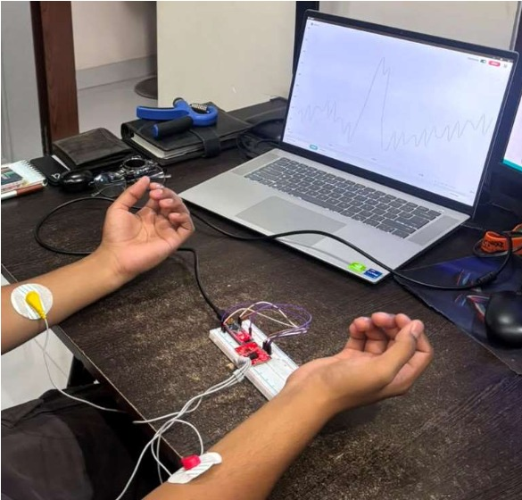
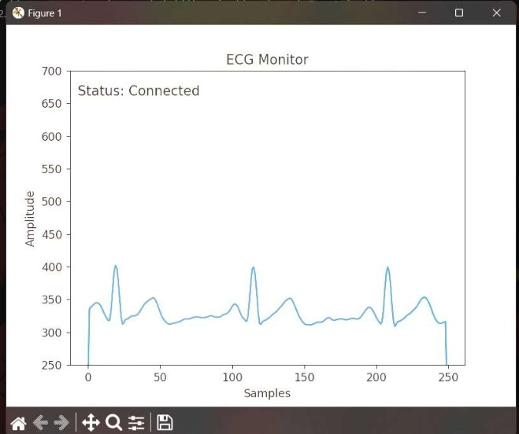
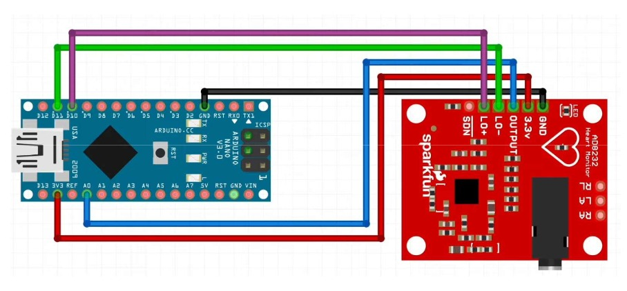

# AI-Integrated ECG Monitoring System using AD8232

A low-cost, AI-powered ECG monitoring system that captures heart signals in real time using an AD8232 ECG sensor and an Arduino Nano. The system visualizes ECG waveforms and uses a machine learning model to classify signals as normal or abnormal.

## Project Overview

Traditional ECG machines are expensive and require clinical environments and trained professionals. This project demonstrates an affordable and compact alternative by combining embedded systems and machine learning for preliminary cardiac monitoring.

The system captures ECG signals through electrodes connected to the body, processes them using an Arduino Nano, and performs real-time analysis on a computer using Python and machine learning.

## Features

- Real-time ECG signal acquisition
- Live waveform visualization
- AI-based ECG classification
- Low-cost and portable design
- Automatic normal/abnormal detection
- Educational and research applications

---

## Hardware Components

| Component          | Specification                  |
|--------------------|--------------------------------|
| Arduino Nano       | ATmega328P Microcontroller     |
| AD8232 ECG Sensor  | Single Lead Heart Rate Monitor |
| ECG Electrodes     | 3-Lead Body Patch Type         |
| Breadboard         | Standard Prototype Board       |
| Jumper Wires       | Connecting Wires               |

---

## Software Used

- Arduino IDE
- Python
- Serial Plotter
- Scikit-learn
- TensorFlow

---

## System Architecture

```text
ECG Electrodes
       ↓
   AD8232 Sensor
       ↓
   Arduino Nano
       ↓
 Serial Communication
       ↓
      Python
       ↓
 Machine Learning Model
       ↓
 Normal / Abnormal Classification
```

---

## Working Principle

1. ECG electrodes capture the electrical activity of the heart.
2. The AD8232 sensor amplifies and filters the signal.
3. Arduino Nano reads the analog signal through the A0 pin.
4. Data is transmitted to the laptop through serial communication.
5. Python processes the incoming ECG signal.
6. A machine learning model classifies the signal as normal or abnormal.
7. The waveform and classification result are displayed in real time.

---

## Screenshots

### Project Setup


### Electrode Placement


### ECG Waveform


### Circuit Diagram

---

## Installation

Clone the repository:

```bash
git clone https://github.com/SuperHax0rr/ai-ecg-monitoring-system.git
cd ai-ecg-monitoring-system
```

Install the required Python libraries:

```bash
pip install pyserial numpy matplotlib scikit-learn tensorflow
```

---

## Running the Project

### Upload Arduino Code

Open:

```text
arduino/ecg_monitor.ino
```

Upload it to the Arduino Nano using the Arduino IDE.

### Run the Python Program

```bash
python python/ecg_classifier.py
```

---

## Advantages

- Low cost and accessible
- Compact and portable
- Real-time monitoring
- Preliminary cardiac abnormality detection
- Suitable for educational and research purposes

---

## Applications

- Preliminary cardiac screening
- Remote patient monitoring
- Home healthcare systems
- Biomedical signal processing research
- Sports and fitness monitoring

---

## Future Improvements

- Raspberry Pi implementation
- Bluetooth or Wi-Fi connectivity
- Cloud-based monitoring
- Detection of specific arrhythmias
- Custom PCB design
- Fully wearable ECG monitoring device

---

## License

This project is licensed under the MIT License.
